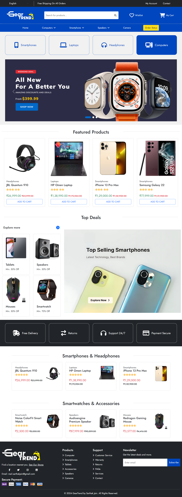
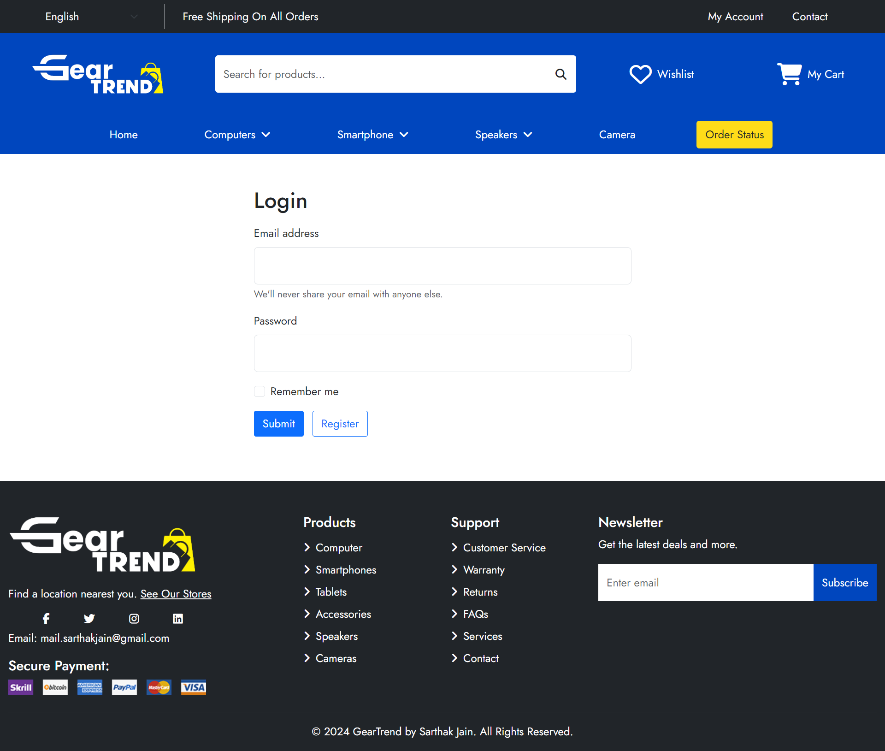
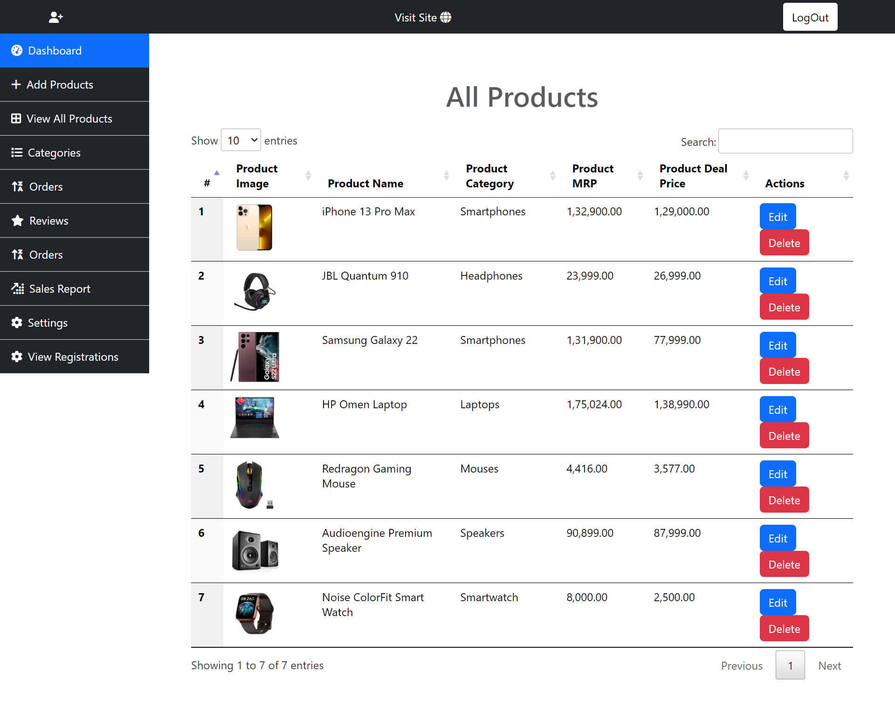

# GearTrend - E-commerce Store

Welcome to GearTrend - E-commerce Store! This is a Node.js-based e-commerce project built with Express, MongoDB, and EJS, showcasing a variety of products and providing admin functionalities.

## Features

- **Home Page:** Displays a selection of products focusing on the latest items.
- **Product Pages:** Includes a demo product page for the iPhone 13 Pro Max.
- **Admin Dashboard:** Manages products and user registrations with filtering capabilities.
- **Product Management:** Upload and view products.
- **User Registration:** Register and manage users.
- **Contact Us:** Form for users to get in touch.
- Responsive Design with Bootstrap
- DataTables used in the admin panel to filter products and user registrations

## Technologies Used

- Node.js
- Express
- MongoDB
- EJS (Embedded JavaScript)
- Bootstrap
- FontAwesome
- Multer (for file uploads)
- DataTables (for admin panel)

## Prerequisites

- Node.js
- MongoDB

## Installation

1. **Clone the repository**:
   ```bash
   git clone https://github.com/the-sarthak-jain/GearTrend-Ecommerce-Store.git
   ```

2. **Navigate into the project directory**:
   ```bash
   cd GearTrend-Ecommerce-Store
   ```

3. **Install dependencies**:
   ```bash
   npm install
   ```

4. **Database Configuration**:

   Modify the `db.js` file in the database folder with the following content:

   ```javascript
   const mongoose = require('mongoose');

   // Replace with your actual MongoDB URI
   const mongoURI = "mongodb+srv://<username>:<password>@cluster0.vzsyypy.mongodb.net/sarthakdb?retryWrites=true&w=majority&appName=Cluster0";

   const con = mongoose.connect(mongoURI, {
       useNewUrlParser: true,
       useUnifiedTopology: true
   })
   .then(() => console.log("Connection Successfully.."))
   .catch((err) => console.log(err));

   module.exports = con;
   ```

5. **Run the application**:
   ```sh
   npm start
   ```

6. **Open your browser and go to `http://localhost:4230`.**

## Project Structure

- `controller/router.js`: Contains all the routes for the application.
- `model/user_schema.js`: Mongoose schema for user registration.
- `model/contact_schema.js`: Mongoose schema for contact form.
- `model/uploadProd-schema.js`: Mongoose schema for product uploads.
- `views/`: Contains all the EJS templates for the application.

## Screenshots

- **Homepage:**


- **Login Page:**


- **Admin Panel:**


## Usage

- **Home Page:**

The home page displays the latest products in both ascending and descending order of their creation dates.

- **Admin Dashboard:**

The admin dashboard allows you to manage products and user registrations. Please log in to access the admin dashboard.

- **Product Details:**

Click on a product to view its details.

- **Contact Forms:**

A contact form is available using MongoDB integration.

## Common Issues

- **Connection Error**: Ensure MongoDB is running and the connection string in `db.js` is correct.
- **Port Conflicts**: Make sure port **4230** is not being used by another application.

## Contributing

Contributions are welcome! Please open an issue or submit a pull request for any improvements or bug fixes.

## Acknowledgments

- [Bootstrap](https://getbootstrap.com/) for styling.
- [FontAwesome](https://fontawesome.com/) for icons.
- [EJS](https://www.npmjs.com/package/ejs) for templating.

## Contact

For any inquiries or support, please contact [Sarthak Jain](mail.sarthakjain@gmail.com).
